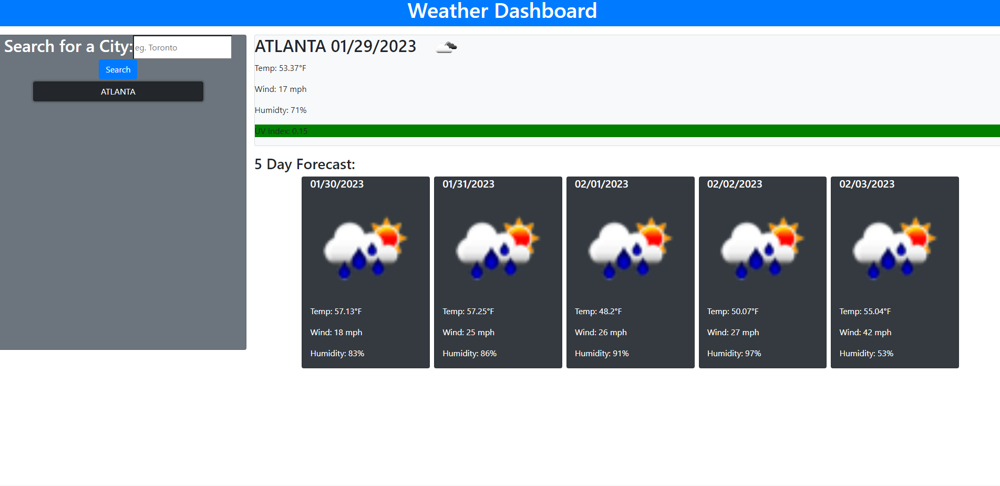

# Weather-Dashboard

## Description

This application was made to allow a user to view the weather of a city they search up. The user can search a city they are going to or interedted in and biew the 5 day forcast of that place.

## Table of Contents

- [Installation](#installation)
- [Usage](#usage)
- [License](#license)
- [Contributing](#contributing)
- [Tests](#tests)
- [Questions](#questions)

## Installation

N/A

## Usage

(https://tylerkandarian.github.io/Weather-Dashboard/)

## License

This project is license under MIT

## Contributing

At this time there is no need to contribute.

## Tests

N/A

## Questions

If you have any questions, please email me at Tyler.Kand2@gmail.com. You can also view more of my work at https://github.com/TylerKandarian.
